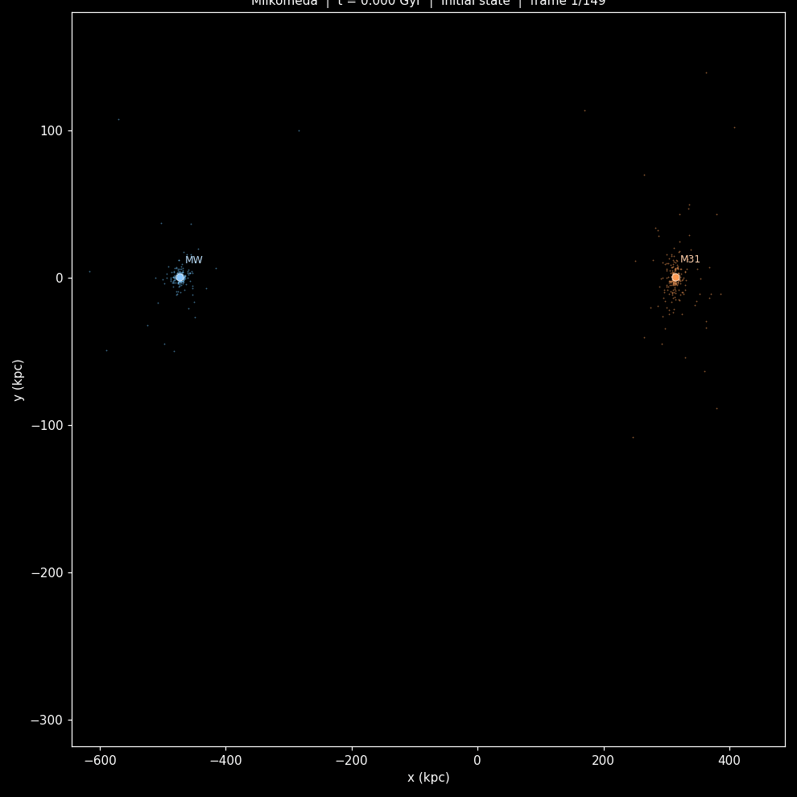
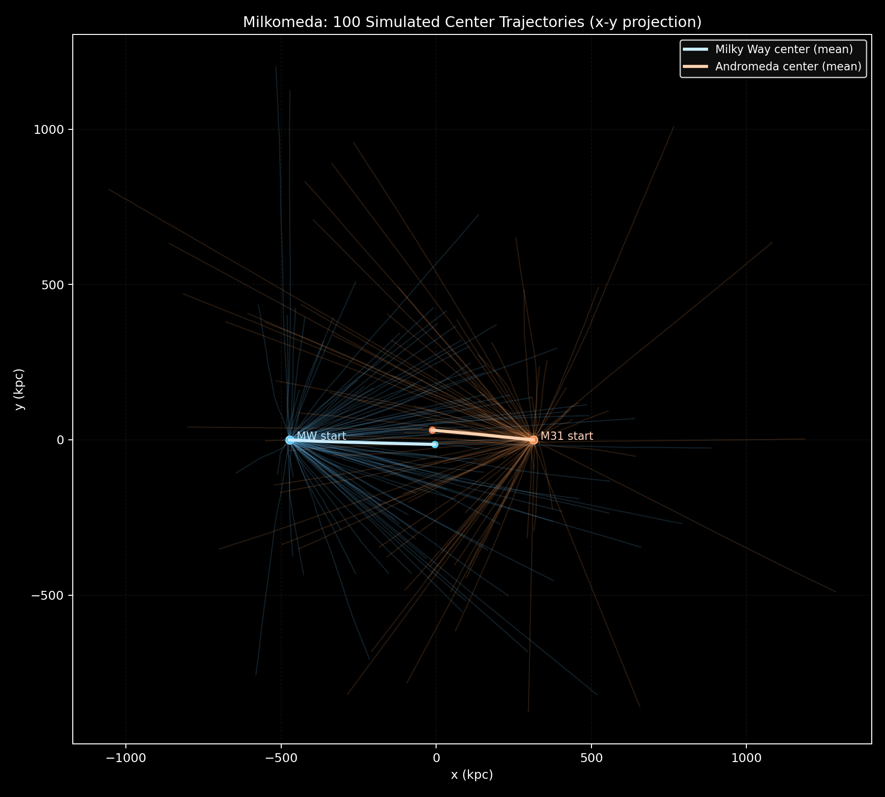

# Milkomeda: Milky Way-Andromeda Collision Simulator

This project simulates the future interaction between the Milky Way and Andromeda using Newtonian gravity.

The goal is simple:
- start from today's approximate positions and velocities,
- evolve both galaxies forward in time,
- visualize their trajectories and collision.

## Results

### 1. Trajectory + Collision Animation (Today to Collision Era)

Generated file:
- `milkomeda_today_to_collision.gif`



What you see:
- two galaxies at separate initial positions,
- approach over billions of years,
- first close encounter around ~4.9 Gyr in this setup,
- trajectory curves for both galactic centers.

### 2. Ensemble of 100 Simulations (Center Trajectories)

Generated with 100 runs to show the spread caused by stochastic particle sampling.

Generated file:
- `trajectories_100.png`



Run settings used for this 100-run result:
- `runs=100`
- `N=40` particles per galaxy per run
- `steps=200`
- `dt=5e6` years
- `sample_every=5`

## Physics Explained for Non-Physicists

### Gravity (the main rule)

Every mass pulls on every other mass. Bigger masses pull harder, and distance weakens the pull.

In formula form:

```
F = G * (m1 * m2) / r^2
```

In plain words:
- if you double one mass, pull doubles,
- if you double distance, pull becomes four times weaker.

### Why this is hard: the N-body problem

A galaxy has many particles (stars + dark matter tracers). Every particle interacts with many others, so calculations grow very fast as particle count increases.

### Barnes-Hut approximation (speed-up)

For distant regions, we do not compute every tiny pull one by one.
We replace far groups of particles with one equivalent "combined mass" at their center of mass.

This preserves the global motion while making the simulation much faster.

### Softening (numerical safety)

If two particles pass extremely close, pure gravity formulas can create unrealistically huge accelerations.

Softening adds a tiny smoothing scale so close passes stay stable and physically plausible at simulation resolution.

### Leapfrog integrator (stable over long time)

The simulator advances in small time steps using a kick-drift-kick method (Leapfrog).

Why this method:
- good long-term energy behavior,
- much better stability over billions of years than naive Euler updates.

## Data and Initial Conditions

The setup uses observationally motivated values (distance, radial approach speed, approximate masses and structure) for:
- Milky Way,
- Andromeda (M31).

Important idea:
- radial speed (toward/away) is measured fairly well,
- tangential speed is harder to measure and strongly affects exact trajectory details.

## How to Run

### Requirements

```bash
python -m pip install numpy scipy matplotlib astropy tqdm h5py pillow
```

### Single simulation (trajectory + collision)

```bash
python simulate.py --N 500 --dt 5e6 --steps 1200 --softening 1.0 --method direct --output output_today_to_collision.h5
python visualize.py --input output_today_to_collision.h5 --output milkomeda_today_to_collision.gif --fps 12 --hold-initial 28 --show-trajectories
```

### 100-run center-trajectory ensemble

```bash
python simulate_100_center_trajectories.py --runs 100 --N 40 --steps 200 --dt 5e6 --sample-every 5 --method direct --output trajectories_100.png
```

### Uncertainty sweep over Andromeda transverse velocity


```bash
python sweep_transverse_velocity.py --vtrans-min 0 --vtrans-max 80 --vtrans-count 9 --runs-per-v 24 --N 120 --steps 500 --dt 5e6 --sample-every 5 --method auto --output-prefix vtrans_sweep
```

Generated outputs:
- `vtrans_sweep_summary.csv` (percentile summary per velocity)
- `vtrans_sweep_raw.npz` (raw sampled traces and metrics)
- `vtrans_sweep_bands.png` (publishable-style uncertainty bands)

### New velocity controls

Both `simulate.py` and `simulate_100_center_trajectories.py` now support:
- `--andromeda-radial-kms` (default `-110.0`)
- `--andromeda-transverse-kms` (default `17.0`)

This replaces the previous single hardcoded transverse speed assumption.

### Validation metrics saved to simulation output

`simulate.py` now records run-level summary metrics into HDF5 metadata:
- minimum mass-weighted COM separation (`min_com_separation_kpc`)
- time of minimum separation (`min_com_separation_time_gyr`)
- first close-approach time at threshold 100 kpc (`first_close_approach_time_gyr`)
- maximum energy drift percent (`max_energy_drift_pct`, when `--validate` is enabled)


